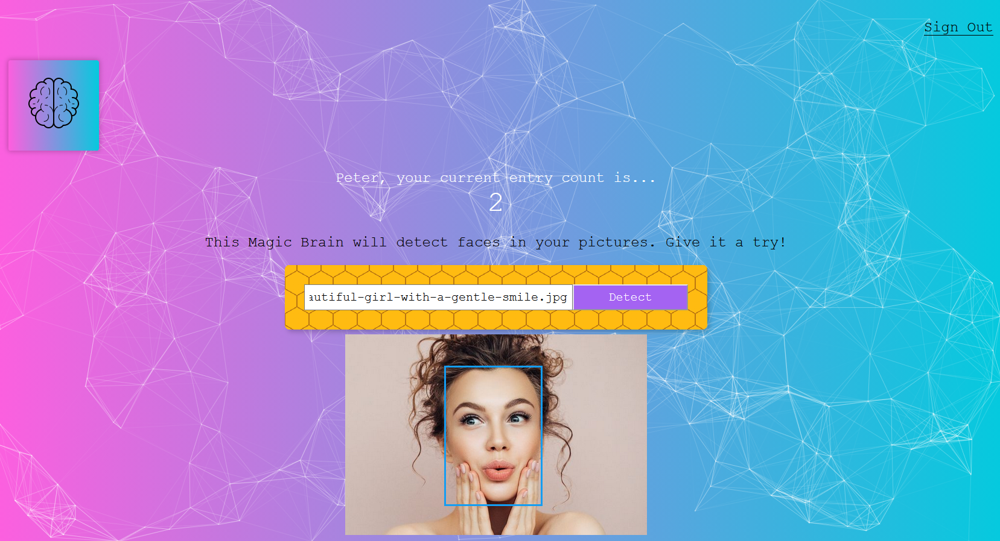

## Smart Brain

A full stack, face detection web application that allows users to register an account and sign-in. The web application takes a URL link to an image and, using the Clarifai API, detects the position where the face is detected an inserts a blue border around the image of the face. Every time you use the app, your Rank goes up by one and is saved onto the database.

If you want to check out the web application, it is hosted on Heroku [here](https://haipa-smartbrain.herokuapp.com/). Although the passwords stored into the PostgreSQL database are hashed, it is best that you do not register with any legitimate information. Once registered or signed in, you just need to copy and paste the image URL onto the search field and press the button. The image should then be displayed with a border to where the predicted face is.

Currently, it is only able to detect one face. The web application will have multiple face detection and various other features, such as user profile customization will be added later.

## Technologies Used
* **Clarifai API**
* **React** for front-end development
* Stylized using **Tachyons**
* Background stylized with **Particles.js**
* Logo interaction using **React-Tilt**

Server-side code can be found [here](https://github.com/haipayazoo/SmartBrainAPI).

